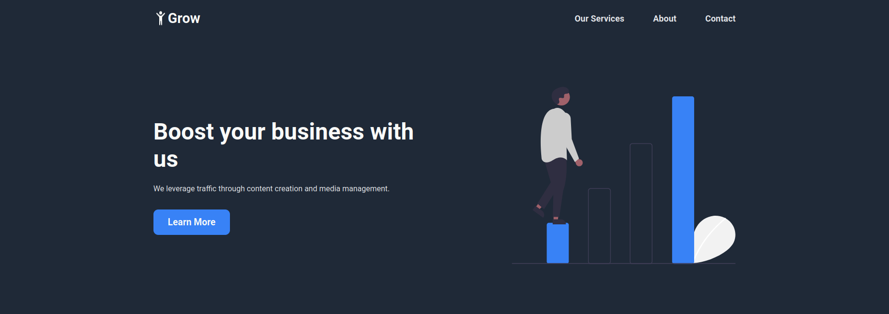

# Grow Landing Page

Landing page for a company named 'Grow'

This is an assignment from [The Odin Project](https://www.theodinproject.com/).

Assignment: Create a landing page based on a given design.

Visit: https://whyucode.github.io/odin-landing-page/

### Tech Stack

HTML5, CSS3

### Lessons Learned

1. Got introduced to CSS transitions and HTML blockquotes.
2. Learnt CSS flexbox.
3. Got to know how to structure a website and put individual components together as various sections in the website.

### Screenshots

